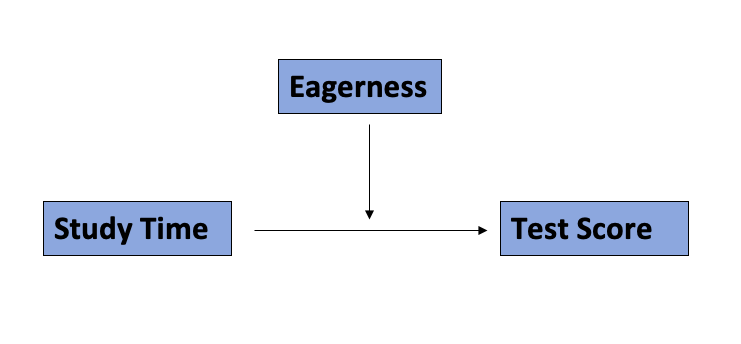

```{r setup, include=FALSE}
knitr::opts_chunk$set(echo = TRUE)
```

## Research Question

* A researcher was interested in investigating whether the relationship between test scores of Portuguese class (G1) and weekly study time (numeric: 1 - less than 2 hours; 2 - 2 to 5 hours; 3 - 5 to 10 hours; or 4 - more than 10 hours) was moderated by eagerness to take higher education (binary: yes or no). The researcher tested a hypothesis using a random sample of 649 students in secondary education of Portuguese schools (see student-por.csv).

```{r, include = FALSE}
library(readr)
library(dplyr)
library(stats)
library(ggplot2)
```

```{r}
# https://archive.ics.uci.edu/ml/datasets/Student+Performance
perf <- read.csv("./data/student-por.csv", sep = ";") %>%
  select(G1, studytime, higher) %>%
  mutate(across(where(is.character), as.factor))
str(perf)
```

<center>



## Hypotheses
* $H_1$: Eagerness to take higher education moderates the relationship between test scores of Portuguese class and weekly study time.
* $H_0$: Eagerness to take higher education does not moderate the relationship between test scores of Portuguese class and weekly study time.

## Critical Test Statistics
* $\alpha$ = 0.05, two-tailed, $df$ = 649 - 3 - 1 = 645
```{r}
qt(p = 0.975, df = nrow(perf) - 4)
```
* Critical $t$ = $\pm$ 1.964

## Sample test statistic results
* Mean-centered the exogenous variable (studytime) - creating variable **studytime.ctr**
```{r}
perf <- perf %>%
  mutate(studytime.ctr = scale(studytime, center = TRUE, scale = FALSE))
head(perf)
```
* Dummy coded the moderator variable (higher) - 0 - No; 1 - Yes.
```{r}
summary(lm(G1 ~ studytime.ctr * higher, data = perf))
```

**Standardized Coefficients**
```{r}
summary(lm(scale(G1) ~ scale(studytime.ctr)*higher, data = perf))
```

## Conclusion
* The results led me to reject $H_0$ and infer that eagerness to take higher education significantly moderates the relationship between test scores and weekly study time.
* [$B$ = 0.897, $\beta$= 0.271, $t$(645) = 2.082, p < 0.05]

## Visualization
* I used the uncentered values on the predictor for the interaction plot.
```{r, out.width = "70%"}
perf %>%
  ggplot(aes(x = studytime, y = G1, color = higher)) +
  geom_jitter(alpha = 0.3) +
  geom_smooth(se = FALSE, method = "lm") +
  labs(title = "Test scores by study time depends on eagerness to higher education",
       x = "Study Time",
       y = "Scores",
       color = "Eagerness")
```

* The pattern of results indicates that the prediction of test scores (G1) by weekly study time depends on the eagerness to higher education of the person. The significant interaction effect that was found is reflected in the different pattern of results that depend on the eagerness to higher education. It shows an ordinal interaction - students with eagerness to higher education always had higher scores on the Portuguese test than ones without eagerness to higher education. There is a positive relationship between test scores and weekly study time in students with eagerness to higher education. On the other hand, students without eagerness to higher education received the lower test scores as they increased the study time (negative relationship).
