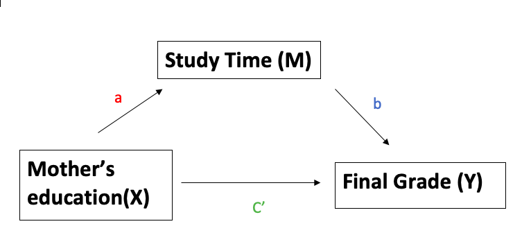

```{r setup, include=FALSE}
knitr::opts_chunk$set(echo = TRUE)
```

```{r, include = FALSE}
library(dplyr)
library(readr)
library(RMediation)
library(MBESS)
```

## Research Question
* A researcher was interested in investigating whether mother's education (numeric: 0 - none, 1 - primary education (4th grade), 2 - 5th to 9th grade, 3 - secondary education or 4 - higher education) affected final grade on Portuguese class (G3) through the indirect effect of mother's education on weekly study time. The researcher tested the hypothesis using a random sample of 649 students (see student-por.csv).

```{r}
# https://archive.ics.uci.edu/ml/datasets/Student+Performance 
perf <- read.csv("./data/student-por.csv", sep = ';') %>%
  dplyr::select(Medu, studytime, G3)
str(perf)
```

<center>



## Hypotheses
* $H_0$: Mother's education affects final grade on Portuguese class through the indirect effect of mother's education on weekly study time.
* $H_1$: Mother's education does not affect final grade on Portuguese class through the indirect effect of mother's education on weekly study time.

## Critical Test Statistics
* $\alpha$ = 0.05, two-tailed, $df$ = 649 - 2 - 1 = 646

## Sample test statistic results
* $a$ coefficient (capturing the “effect” of the exogenous variable, `Medu`, on the mediator, `studytime`):
```{r}
mod1 <- lm(studytime ~ Medu, data = perf)
summary(mod1)
```
* $a$ = 0.071, $S_a$ = 0.029
\
* $b$ coefficient from the slope for the mediator, `studytime`, in the model predicting the distal outcome, `G3`, using both the mediator and the exogenous variable, `Medu`:
```{r}
mod2 <- lm(G3 ~ Medu + studytime, data = perf)
summary(mod2)
```
* $b$ = 0.891, $S_b$ = 0.145

```{r}
a <- unname(mod1$coefficients[2])
b <- unname(mod2$coefficients[3])
print(a*b)
```
* The indirect effect estimate, `ab` = 0.063

## Confidence Interval
* Then, I used Meeker & Escobar’s (1994) distribution of products procedure to calculate the 95% confidence interval estimate of the indirect effect using R’s RMediation package (Tofighi & MacKinnon, 2011) and the medci function as follows:

```{r}
medci(mu.x = mod1$coefficients[2],
      mu.y = mod2$coefficients[3],
      se.x = coefficients(summary(mod1))[2,2],
      se.y = coefficients(summary(mod2))[3,2],
      type = 'dop'
      )
```

## Conclusion
* Reject $H_0$ and infer that mother's education significantly affects final grade on Portuguese class through the indirect effect of mother's education on weekly study time [$ab$ = 0.063, distribution of products 95% CI = (0.013, 0.122), $p$ < 0.05].
\
* In addition to the indirect effect that was detected, there is also a significant direct effect of mother's education (`Medu`) on the outcome (`G3`) that captures the mother's education’s effect on final grade over and above its
indirect effect through weekly study time [$C^\prime$ = 0.621, $t$(646) = 5.843, $p$ < 0.05].

## Bootstrapping
```{r}
mediation(x = perf$Medu,
          mediator = perf$studytime,
          dv = perf$G3,
          bootstrap = TRUE)
```

* With results leading to the same inference statistically (statistically significant indirect effect) with the same point estimate (`ab` = 0.0632) and different 95% confidence interval values (0.013, 0.118) for regular bootstrapped estimate and (0.015, 0.121) for the accelerated, bias-corrected bootstrapped estimate.
